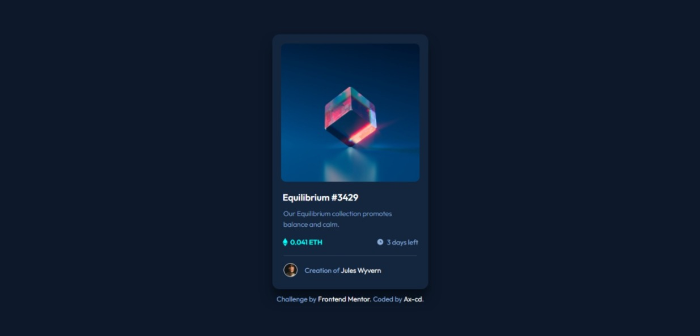

# Frontend Mentor - NFT preview card component solution

This is a solution to the [NFT preview card component challenge on Frontend Mentor](https://www.frontendmentor.io/challenges/nft-preview-card-component-SbdUL_w0U). Frontend Mentor challenges help you improve your coding skills by building realistic projects.

## Table of contents

- [Overview](#overview)
  - [Links](#links)
  - [The challenge](#the-challenge)
  - [Screenshot](#screenshot)
- [My process](#my-process)
  - [Built with](#built-with)
  - [Continued development](#continued-development)
  - [Useful resources](#useful-resources)
- [Author](#author)

## Overview

### The challenge

Users should be able to:

- View the optimal layout depending on their device's screen size
- See hover states for interactive elements

### Links

- Solution URL: [Frontend Mentor](https://www.frontendmentor.io/solutions/nft-preview-card-using-html-and-css-HkhLxksE9)
- Live Site URL: [GitHub Page](https://ax-cd.github.io/nft-preview-card-challenge/)

### Screenshot

## My process

### Built with

- Semantic HTML5 markup
- CSS custom properties
- Flexbox
- Mobile-first workflow

### Continued development

I started this project with Sass but then switched back to CSS because I hit a block. So, for the next projects I want to try styling using Sasss.

### Useful resources

- ["How to overlay images with CSS" by w3docs](https://www.w3docs.com/snippets/css/how-to-overlay-images-with-css.html) - A helpful reminder.

## Author

- Frontend Mentor - [@Ax-cd](https://www.frontendmentor.io/profile/Ax-cd)
- GitHub - [@Ax-cd](https://github.com/Ax-cd)
- Instagram - [@ax.coding](https://www.instagram.com/ax.coding/)
